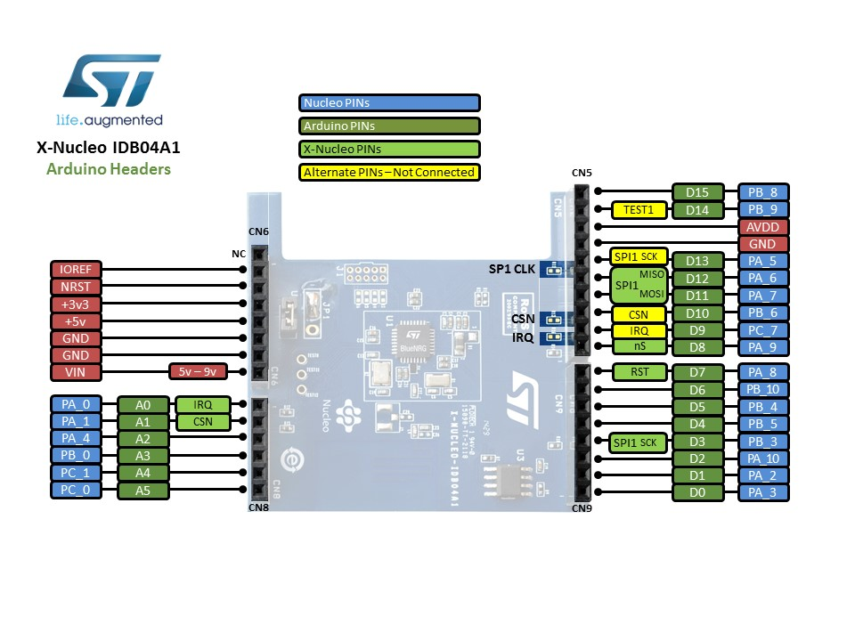

# sailoraid
Sensor package for the Laser Pico sail boat

[BlueNRG (Old Bluetooth module) Datasheet](Docs/BlueNRG_Datasheet.pdf)

[SPBTLE (Bluetooth module) Datasheet](Docs/BlueNRG_Datasheet.pdf)

[EVA2235-H (GPS) Datasheet](Docs/EVA2235-H.pdf)

[LSM6DSL (Acc/Gyro) Datasheet](Docs/LSM6DSL.pdf)

[LSM303C (Acc/Mag) Datasheet](Docs/LSM303C.pdf)

[STM32F411 (MCU) Datasheet](Docs/STM32F411_Datasheet.pdf)

[STM32F411 (MCU) Reference Manual](Docs/STM32F411_Reference_Manual.pdf)

